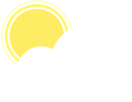

  

<h3 align="center">Météa</h3>

  Un site de météo moderne, basé sur des APIs
   
  <a href="http://localhost:3000/"><strong>Explorer Météa »</strong></a>
   
   
  <a href="https://github.com/noftaly/SOON/issues/new?template=bug.md">Reporter un bug</a>
  ·
  <a href="https://github.com/noftaly/SOON/issues/new?template=feature.md&labels=feature">Suggérer une fonctionnalité</a>
  ·
  <a href="https://discord.gg/">Discord</a>

## Description

  "Météa" est un site indiquant la météo ainsi que des prévisions, à partir d'APIs. La principale API utilisée
  est <a href="https://darksky.net" target="_blank">darksky.net</a>. Pour la recherche de localisation par nom ou
  par géolocalisation, nous utilisons l'API <a href="https://opencagedata.com"
    target="_blank">opencagedata.com</a>. Les graphiques sont réalisés grâce à la librairie ChartJS. 

## Installation

Pour utiliser le site localement, vous avez besoin de clé d'APIs. Pour cela, renommez `.env.template` en `.env`, et mettez-y vos clés d'API, comme spécifié
Ensuite, allez dans votre répertoir à partir d'un terminal, puis installez les dépendences : `npm i`, et enfin, lancez le serveur : `npm start`.

## To Do

- [ ] Ajouter plus de choses sur la page d'accueil (tempêtes, catastrophes, pics de temperatures...)
- [ ] Ajouter des thèmes (blanc/noir)
- [ ] Ajouter une doc pour l'api
- [ ] Ajouter un support de plusieurs langues
- [x] Dans `weatherData`, éxecuter les 2 promesses en même temps
- [x] Ajouter la localisation automatique
- [x] Ajouter une API, qui renvoit des infos sur une ville, ou des des infos sur la météo
- [x] Ajouter la map
- [x] Ajouter les graphiques
- [x] Faire fonctionner les inputs
- [x] Améliorer les textes descriptifs
- [x] Ajouter les alertes
- [x] Faire les onglets "Prochaines heures" et "Prochains jours"

## En cours :

- Ajouter plus de choses sur la page d'accueil (tempêtes, catastrophes, pics de temperatures...)
